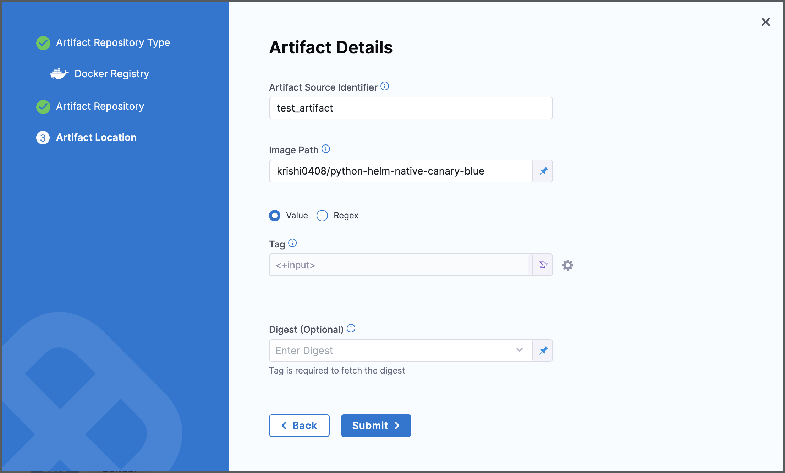
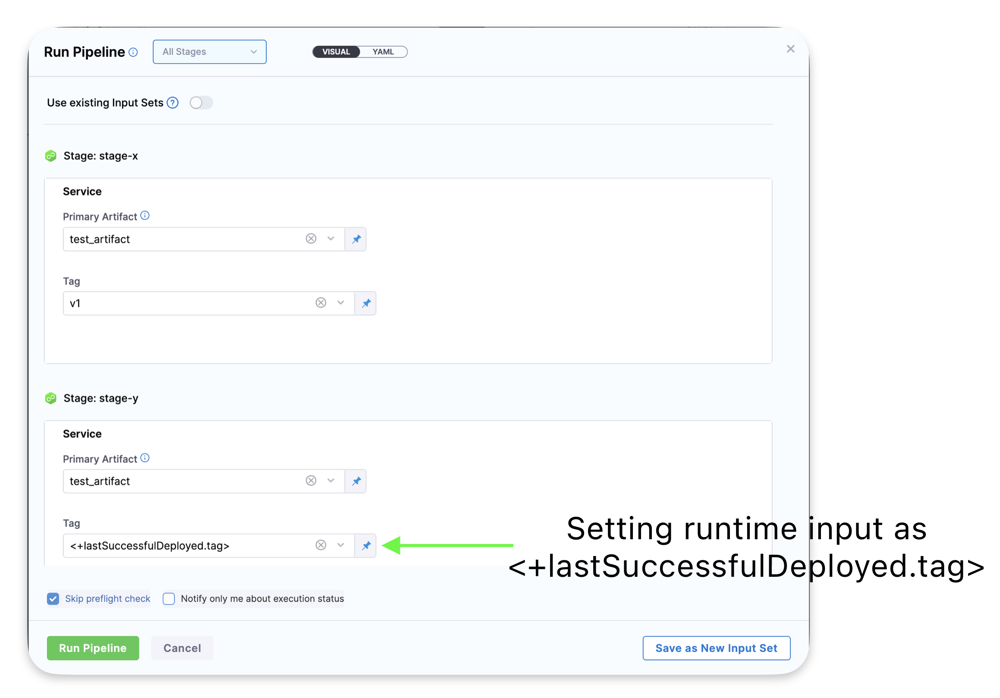

# Last Successful Artifact Tag

## Feature Overview

We have introduced a new expression, `<+lastSuccessfulDeployed.tag>`, which allows you to retrieve the tag version of the last successfully deployed artifact. This feature provides flexibility and consistency when managing artifact tags in your deployment pipelines.

## Using the tag

Navigate to **Servic**e configuration, either in the project settings or in the service tab in the pipeline.
Under **Artifacts**, add a new artifact or edit the existing artifact. In the **Artifact Location**, set the Tag as expression or a Runtime-input.

Now, while running the pipeline, set the tag expression as `<+lastSuccessfulDeployed.tag>`

## Use Cases

1. Re-running Pipelines
The `<+lastSuccessfulDeployed.tag>` expression can be used to fetch the artifact tag from the most recent successful deployment when re-running a pipeline. This ensures that the correct version is deployed without requiring manual input.

2. Using the Expression Across Stages in the Same Pipeline
You can use `<+lastSuccessfulDeployed.tag>` across different stages of the same pipeline, provided the stages share the same service, environment, and infrastructure configuration.

Example:

- In a pipeline with two stages, stage-x and stage-y, you define an artifact tag (e.g., tag-v1) in the deployment configuration of stage-x.
- In stage-y, you can reference `<+lastSuccessfulDeployed.tag>` to resolve the artifact tag (tag-v1), as long as both stages use the same service, environment, and infrastructure.

3. Handling Different Environments or Infrastructures
If the environment or infrastructure differs between stages (e.g., stage-y uses a different environment from stage-x):

- On the first execution, the expression `<+lastSuccessfulDeployed.tag>` will throw an error because there is no prior successful deployment for that combination.
- On subsequent executions, the expression will resolve to the tag used in the most recent deployment for the specified service, environment, and infrastructure combination.

4. Pipeline Agnostic Behavior
The expression `<+lastSuccessfulDeployed.tag>` is pipeline agnostic. This means if a service with an artifact is used in multiple pipelines, the resolved tag will remain consistent across all pipelines.
Example:

- A service with artifact-X (tag-v1) is used in pipeline-1 and pipeline-2.
- If artifact-X was successfully deployed twice in pipeline-1 (latest tag: tag-v2) and not in pipeline-2, deploying in pipeline-2 with `<+lastSuccessfulDeployed.tag>` will resolve to tag-v2.

5. Scope Agnostic Behavior
The expression `<+lastSuccessfulDeployed.tag>` is scope agnostic within the same account, with the behavior dependent on the organizational and project hierarchy:

- Example 1: If two organizations have the same service_id, env_id, and infra_id, the resolved tag will be retrieved from the organization where the pipeline is executed.
- Example 2: If two projects within the same organization share the same identifiers, the resolved tag will be retrieved from the project and organization running the pipeline.
- Example 3: Across projects or organizations with overlapping identifiers, the resolved tag is retrieved based on the project and organization where the pipeline is executed.

Note: This expression only resolved primary artifact tags. Sidecar artfact tags cannot be resolved using this expression.

For more information, go to [Harness Documentation](https://developer.harness.io/docs/continuous-delivery/x-platform-cd-features/services/artifact-sources/#runtime-input-for-the-latest-artifact-tag)

This feature ensures seamless artifact versioning across stages and pipelines, reducing manual effort and increasing deployment accuracy.