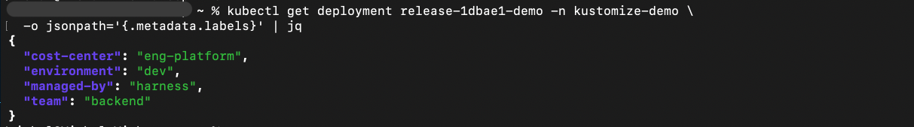

# Helm Label Injection via Kustomize Post-Renderer

This example demonstrates how to inject standard labels onto **every Kubernetes resource** deployed via Helm — without modifying any Helm chart. Labels are defined once, centrally, and applied across all deployments automatically.

---

## Problem Statement

Organizations deploying applications via Helm often need to enforce a standard set of labels (team ownership, cost center, environment, compliance tags) on all live Kubernetes resources. The naive approaches fail:

| Approach | Why it fails |
|---|---|
| `helm install --labels` | Labels only the Helm *release secret*, not the actual K8s resources |
| `--set podLabels.*` | Only works if every chart has a `podLabels` placeholder — requires editing all charts |
| `kubectl label` post-deploy | Not part of the manifest; silently wiped on the next `helm upgrade` |

The core constraints:
- **No chart edits** — organizations with thousands of charts cannot add label placeholders to each one
- **Centrally managed** — labels defined once, changed once, no per-pipeline configuration
- **Persistent** — labels must survive every redeploy
- **Minimal configuration** — teams inherit the behavior via a shared service/pipeline template

---

## Solution: Kustomize as a Helm Post-Renderer

Helm's native `--post-renderer` hook pipes rendered manifests through an external binary before `kubectl apply`. We plug Kustomize's `labels` transformer in here:

```
helm template  →  (stdin)  →  post-render.sh  →  kustomize labels transformer  →  (stdout)  →  kubectl apply
```

- **Charts are never touched** — injection happens after rendering
- **Single source of truth** — all labels live in `post-render.sh` on the delegate
- **Persistent** — labels are part of what gets applied to the cluster
- **Template once** — the `--post-renderer` flag goes in the service manifest; all pipelines using that service inherit it automatically

---

## How It Works

### 1. The Post-Renderer Script

`delegate-setup/post-render.sh` is a small wrapper that:
1. Receives Helm's rendered YAML on **stdin**
2. Writes a temporary `kustomization.yaml` with the central label set
3. Runs `kustomize build` and prints the result to **stdout**
4. Harness applies that output to the cluster

```bash
# Helm calls this binary with rendered manifests on stdin
cat > "$WORK/all.yaml"           # capture stdin
kustomize build "$WORK"          # inject labels, print to stdout
```

### 2. Label Transformer Configuration

The `kustomization.yaml` uses two important flags:

```yaml
labels:
  - includeSelectors: false    # do NOT add to selector fields (keeps them immutable)
    includeTemplates: true     # DO add to pod templates (so pods carry the labels)
    pairs:
      team: backend
      cost-center: eng-platform
      managed-by: harness
      environment: dev
```

- `includeSelectors: false` — labels are added to `metadata.labels` but not `selector.matchLabels`, so you can add/remove labels on future deploys without hitting "field is immutable" errors
- `includeTemplates: true` — labels reach pod `spec.template.metadata.labels`, making them available for monitoring tools and network policies

### 3. Harness Service Configuration

The `--post-renderer` flag is added to the Helm manifest's `commandFlags` for `Template`, `Install`, and `Upgrade`:

```yaml
commandFlags:
  - commandType: Template
    flag: --post-renderer /opt/harness-delegate/client-tools/post-render.sh
  - commandType: Install
    flag: --post-renderer /opt/harness-delegate/client-tools/post-render.sh
  - commandType: Upgrade
    flag: --post-renderer /opt/harness-delegate/client-tools/post-render.sh
```

For complete service YAML, refer to [service.yaml](./service.yaml)

---

## Folder Structure

```
helm-kustomize-post-renderer/
├── Description.md              # this file
├── pipeline.yaml               # tested Harness pipeline (K8sRollingDeploy + verify step)
├── service.yaml                # Harness service with post-renderer command flags
├── delegate-setup/
│   └── post-render.sh          # the post-renderer script — place on your delegate
└── helm-chart/                 # minimal demo chart (no label placeholders — intentional)
    ├── Chart.yaml
    ├── values.yaml
    └── templates/
        ├── deployment.yaml
        └── service.yaml
```

---

## Setup Instructions

### Step 1: Install kustomize on the delegate

```bash
# exec into your delegate pod
kubectl exec -it <delegate-pod> -n <delegate-namespace> -- bash

# download kustomize
curl -sSL https://github.com/kubernetes-sigs/kustomize/releases/download/kustomize%2Fv5.4.3/kustomize_v5.4.3_linux_amd64.tar.gz \
  | tar -xz -C /tmp
install -m 0755 /tmp/kustomize /opt/harness-delegate/client-tools/kustomize

# verify
/opt/harness-delegate/client-tools/kustomize version
```

### Step 2: Place the post-renderer script on the delegate

```bash
# copy delegate-setup/post-render.sh from this repo onto the delegate
kubectl cp delegate-setup/post-render.sh \
  <delegate-namespace>/<delegate-pod>:/opt/harness-delegate/client-tools/post-render.sh

chmod +x /opt/harness-delegate/client-tools/post-render.sh
```

Or copy the content directly inside the delegate pod:

```bash
kubectl exec -it <delegate-pod> -n <delegate-namespace> -- bash -c \
  'curl -sSL https://raw.githubusercontent.com/harness-community/harnesscd-example-apps/master/custom-usecases/helm-kustomize-post-renderer/delegate-setup/post-render.sh \
   -o /opt/harness-delegate/client-tools/post-render.sh && \
   chmod +x /opt/harness-delegate/client-tools/post-render.sh'
```

> **For production:** bake both `kustomize` and `post-render.sh` into the delegate image or the delegate's `INIT_SCRIPT` environment variable so they survive pod restarts.

### Step 3: Push the Helm chart to your GitHub repo

Upload the contents of `helm-chart/` to a folder in your Git repository. Note the folder path — you will reference it in the service's `folderPath` field.

### Step 4: Create the Harness service

Import [service.yaml](./service.yaml) and fill in:
- `connectorRef` — your GitHub connector
- `folderPath` — path to the chart folder in your repo
- `branch` — your default branch (e.g. `main`)

### Step 5: Import the pipeline

Import [pipeline.yaml](./pipeline.yaml) and wire it to the service, environment, and infrastructure you created.

### Step 6: Create the target namespace

```bash
kubectl create namespace <your-namespace>
```

---

## Customizing Labels

Edit the `pairs` block in `delegate-setup/post-render.sh` — this is the only file you ever change to add, remove, or update labels across all deployments:

```yaml
labels:
  - includeSelectors: false
    includeTemplates: true
    pairs:
      team: backend              # ← change these
      cost-center: eng-platform
      managed-by: harness
      environment: dev
      # add more labels here
```

You can also reference Harness expressions if you use a Harness-native approach (e.g. via pipeline variables passed through a configmap).

---

## Verification

After the pipeline runs, confirm labels on live resources:

```bash
# All resources with labels in one view
kubectl get deploy,svc,pod -n <namespace> --show-labels

# Clean column view per label
kubectl get deploy,svc,pod -n <namespace> \
  -L team -L cost-center -L managed-by -L environment
```

**Expected output:**

```
NAME                              READY   LABELS
deployment.apps/release-xxx-demo  1/1     cost-center=eng-platform,environment=dev,managed-by=harness,team=backend

NAME                        TYPE        LABELS
service/release-xxx-demo    ClusterIP   cost-center=eng-platform,environment=dev,managed-by=harness,team=backend

NAME                              READY   STATUS    LABELS
pod/release-xxx-demo-xxx          1/1     Running   app=release-xxx-demo,cost-center=eng-platform,environment=dev,managed-by=harness,team=backend
```

The chart templates had **none** of these labels — they were injected entirely by the post-renderer.



---

## Label Schema

| Label | Example value | Purpose |
|---|---|---|
| `team` | `backend` | Team ownership |
| `cost-center` | `eng-platform` | Cost allocation |
| `managed-by` | `harness` | Deployment tool tracking |
| `environment` | `dev`, `prod` | Environment identification |

---

## Key Differences vs `helm-labeling` Example

| | [helm-labeling](../helm-labeling/) | This example |
|---|---|---|
| **Mechanism** | `--set commonLabels.*` via chart values | Kustomize post-renderer |
| **Chart changes required** | Yes — chart must have `commonLabels` placeholder | **No — works with any chart** |
| **Deployment type** | NativeHelm | Kubernetes (K8sRollingDeploy) |
| **Label target** | Resources that reference `commonLabels` in templates | **Every resource Helm renders** |
| **Central management** | Flags in service manifest | Single script on delegate |
| **Best for** | Charts you own/control | **Any chart, including third-party** |

---

## Requirements

- **Kubernetes**: 1.21+
- **Helm**: 3.x (on delegate)
- **Kustomize**: 5.x (installed on delegate — see Step 1)
- **Deployment type**: `Kubernetes` (K8sRollingDeploy, not NativeHelm)
- **Chart compatibility**: None — works with any chart unchanged

---

## Related Documentation

- [Helm Post-Renderer Documentation](https://helm.sh/docs/topics/advanced/#post-rendering)
- [Kustomize Labels Transformer](https://kubectl.docs.kubernetes.io/references/kustomize/kustomization/labels/)
- [Harness Native Helm Deployment](https://developer.harness.io/docs/continuous-delivery/deploy-srv-diff-platforms/helm/helm-cd-quickstart/)
- [Harness K8s Rolling Deployment](https://developer.harness.io/docs/continuous-delivery/deploy-srv-diff-platforms/kubernetes/kubernetes-executions/create-a-kubernetes-rolling-deployment/)
