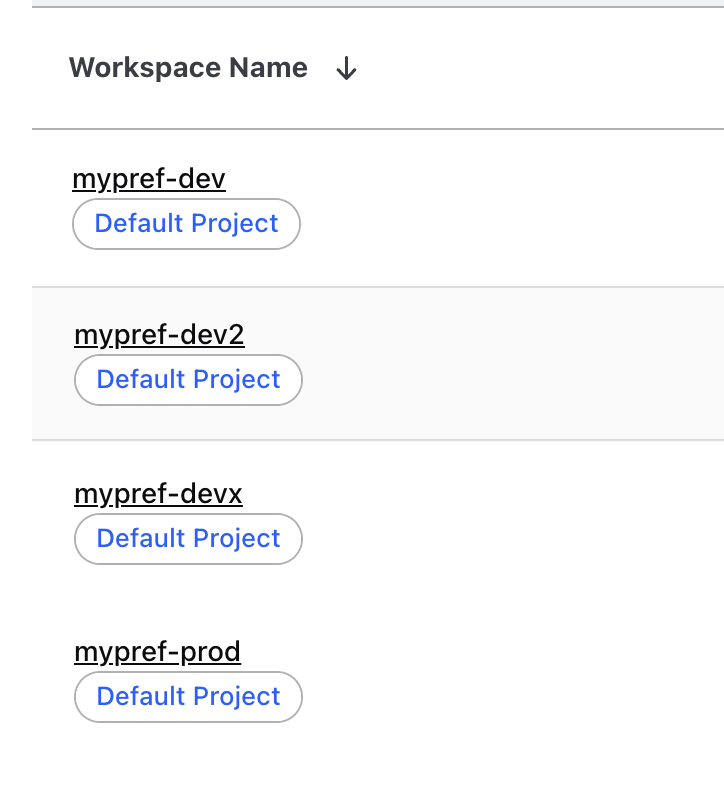
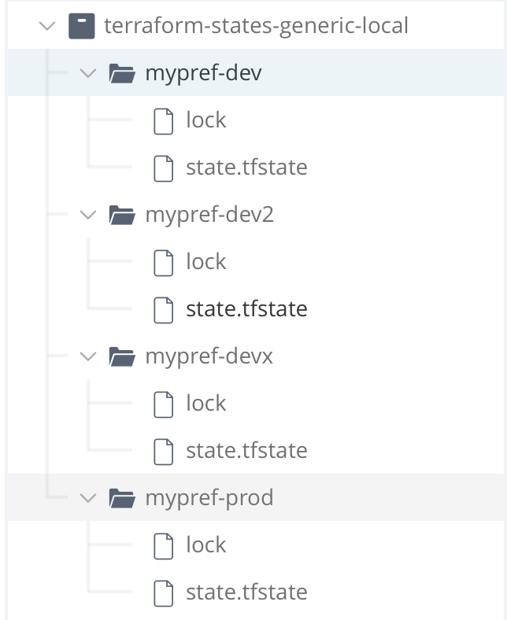

# Terraform Workspace + Remote State Management Step Template

## Overview

This step template helps you automatically create a Terraform workspace in Terraform Cloud (or Enterprise) **and** prepare a remote backend using **JFrog Artifactory** to store the state and lock files. It provides a hybrid workflow where Terraform Cloud handles logical workspace management while Artifactory serves as the remote state backend — ideal for cloud-agnostic infrastructure strategies.

## Use Case Solved

- You're using **Terraform Cloud (TFC)** or **Terraform Enterprise (TFE)** to manage your infrastructure workflow and logical workspaces.
- You want to **store the actual state files in a separate remote backend** like JFrog Artifactory, rather than in Terraform Cloud.
- You need to **dynamically create Terraform workspaces** and ensure the corresponding Artifactory structure (state and lock files) is initialized before provisioning.

## What This Template Does

- Checks if a Terraform Cloud workspace exists based on a prefix and dynamic suffix.
- If the workspace doesn't exist:
  - Creates it using the Terraform Cloud API.
  - Creates an empty `state.tfstate` file and `lock` file in a JFrog Artifactory directory named after the workspace.
- If the workspace already exists:
  - Skips creation and prints a confirmation message.
- Outputs the workspace name and Artifactory state file path as pipeline variables for use in subsequent steps.

## How to Use

1. Add this step template to your Harness pipeline.
2. Set the pipeline variables:
   - `workspace_prefix`
   - `workspace_suffix`
   - `org_name` (Terraform Cloud organization)
3. Configure Harness secrets:
   - `tfe_token` (Terraform Cloud API token)
   - `jfrog_identity_token` (Bearer token for Artifactory access)
4. Use the output variables (`WORKSPACE_NAME`, `STATE_FILE_PATH`) in Terraform init and apply stages that reference the Artifactory backend.

## Requirements

- A **Terraform Cloud or Enterprise** account with an API token.
- A **JFrog Artifactory** instance with a Generic repository configured.
- Valid **identity token** for pushing files to Artifactory.
- Harness secrets setup for both Terraform Cloud and Artifactory credentials.

## Example Scenario

If your workspace prefix is `mypref-` and the dynamic suffix is `dev`, this template:

- Creates a Terraform Cloud workspace named `mypref-dev` (if not already present).
- Initializes remote storage for the workspace in Artifactory:

Here’s how the Terraform Cloud workspace and the JFrog Artifactory repository would look after the workspace creation and remote backend initialization:

**JFrog Repository Structure**

**Terraform Cloud Workspace**

